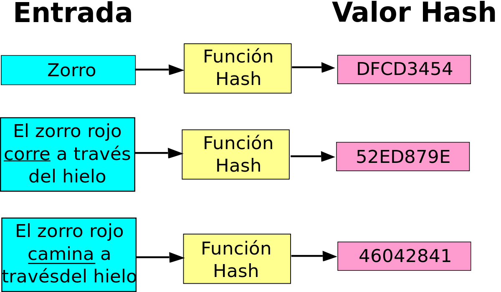

# INFORMÁTICA FORENSE

### ¿Qué es la Informática Forense?

#### 
La Informática Forense es la aplicación de técnicas científicas y analíticas especializadas a infraestructura tecnológica que permiten identificar, preservar, analizar y presentar datos que sean válidos dentro de un proceso legal.

## 
Conceptos Básicos y sus Definiciones:

A continuación se explicará brevemente algunos de los conceptos que se usan dentro de la Informática Forense y que serán de ayuda en los procesos siguientes para su comprensión.

### * **_Artefactos_**

Objetos obtenidos sobre el proceso de adquisición forense (disco duro, computadora, memorias usb, memorias ram, etc).

### * **_Prueba Digital_**

Parte documental que es presentada en una Causa Judicial, la cual deberá ser constatada por un Perito Informático, de esta forma se avala que es una prueba real o es algo que esta adulterado.

### * **_Evidencia Digital_**

Se habla de evidencia digital cuando una prueba ha sido constatada por el experto y en donde se tiene una certeza ya clara y manifiesta de la que no se puede dudar.

### * **_Criptografía_**

Arte y técnica de escribir con procedimientos y claves secretas o no tan secretas, de tal forma que lo esrito solamente sea inteligible para quien sepa y posea de la/s clave/s necesaria/s para descifrarlo.

### * **_HASH_**

Algoritmo con el cual podemos asegurar la integridad de los artefactos desde el momento de la adquisición hasta el momento de la entrega del Informe Perificial.

Por ejemplo si en nuestra entrada aplicamos una función de hash se obtiene un valor, dicho valor será hexadecimal y va a tener un tamaño finito. Esto se puede observar en la imagen que se presenta a continuación, en donde la entrada es una palabra la cual va cambiando posteriormente por una oración y su salida de igual forma da como resultado un valor Hash diferente.

[Figura 1]

Es por eso que es tan importante dentro de la informática forense, ya que con este algoritmo se puede asegurar la integridad, de esta manera se podrán llevar los artefactos desde la adquisición, hasta la entrega y así podremos asegurar que es el mismo que el que presentamos.

Los algoritmos conocidos y que podrían ser utilizados pueden ser MD5, SHA1, SHA256 y SHA512, aunque cabe aclarar que los primeros dos ya son considerados rotos, por lo cual se recomiendan para el uso adecuado SHA256 y SHA512.

### * **_Cadena de Custodia_**

Es la manera en que se asegura la NO alteración de los artefactos recolectados desde su adquisición hasta la presentación de la evidencia.

## **Fases de la Informática Forense**

La informática forense tiene 4 fases y se deben de seguir de forma cronologica, dichas fases son las siguientes:
 
### * **_Identificación del Incidente_**

Se debe introducir en el momento, el entorno, la causa y el activo informático al cual hay que realizarle forense (Computadora, nube, celular, etc).

Es importante además saber identificar bien el entorno y el problema, ya que si en un caso se desconecta el cableado o se apaga el equipo y hay información en la memoria se perderian todos esos datos que podrían contener información útil para la investigación.

####  Etapa 1: Levantamiento de información Inicial

En dicho punto el forense que ya fue solicitado por un administrador de sistemas. Deberá solicitar datos como fecha del incidente, duración y detalles del mismo. Además de solicitar datos de contacto del responsable del sistema afectado, como telefono, correo, direccion, etc. 

De igual forma se deben solicitar datos del dispositivo(s) o equipos afectados, talés como dirección IP, marca, modelo, seriales, sistema operativo, etc.

Es importante que una vez obtenidos estos datos, se deberan sacar copias de la información para poder trabajar sobre ella y no sobre la original. 

#### Etapa 2: Asegurar la escena

Cuando se tome evidencia de los dispositivos afectados, se deberán identificar correctamente según el tipo de dispositivo. Por ejemplo si es un sistema informático, dispositivo móvil, etc; así como también según el medio de almacenamiento.

### * **_Validación y Preservación de la Evidencia_**

Es esencial mantener la integridad de los artefactos. De otro modo se estaría contaminando la evidencia y la misma no tendría valor alguno.

Es importante además en este caso, mantener la integridad de todos los artefactos de forma que todo lo que se vaya a presentar como evidencia sea al 100% integro y que nunca sea contaminado (Discos duros, memorias ram, usb, información digital, etc).

#### Etapa 1: Copias de la Evidencia

Para cumplir con la integridad de la evidencia como primer paso se recomienda sacar dos copias de las evidencias obtenidas. De esta forma nos aseguramos de mantener el original intacto y se trabajará solo con las copias en todo momento.

Cada copia además deberá tener una suma de comprobación de la integridad haciendo uso de funciones algoritmicas (HASH)

De igual forma se deberá identificar cada evidencia con la fecha y hora en la cual se saco dicha copia y anexando además su hash para poder validar que los datos no han sido alterados, todo esto deberá llevar un registro de la persona que realizó dicha actividad.

#### Etapa 2: Cadena de Custodia

En todo momento se deberá tener conocimiento de quien ha tenido acceso a las evidencias recolectadas. Por lo cual en cada etapa se prepara un documento donde se registren los datos de las personas que han accedido a dichas evidencias y en que fecha exacta. 

Además toda información que se pueda registrr será de apoyo en el proceso, desde como se ha transportado la evidencias, en que sitios ha estado, etc. Para poder darle seguimiento a ese proceso y garantizar la integridad de la misma.

### * **_Análisis de la Evidencia_**

A partir de lo adquirido se tendrán que analizar las pruebas digitales, para que; posteriormente se llegue a una conclusión que sirva a la causa.

Existen herramientas que se utilizan para analizar las evidencias digitales, por lo cual se deben identificar cuales son las más pertinentes para realizar el análisis y de esta manera conseguir elaborar la línea de tiempo y ubicar los tiempos en los que sucedio el ataque.

#### Etapa 1: Preparación para el análisis

En dicha etapa se prepara todo lo necesario para el análisis de las evidencias. Por lo cual en ciertas ocasiones se necesitara equipo donde se montarán imagenes de las evidencias para su análisis. 

#### Etapa 2: Reconstrucción del ataque

Esta etapa puede tomar más tiempo, dependiendo el caso. Ya que se busca crear la línea de tiempo con la información que se recolecto como evidencia. Empezar a organizar fechas en las que fueron manipulandose los archivos o en otro caso borrados. 

Es por ello que el encargado de revisar dicha información, debe profundizar analizando cada archivo y así obteniendo datos como tamaños del archivo, marcas de tiempo MACD, rutas, permisos, etc.

#### Etapa 3: Determinación del ataque

Posteriormente ya que se haya determinado una línea de sucesos del ataque, se deberá determinar el punto por el cual el atacane ingresó al sistema. 

Las razones pueden ser muchas, puede ocurrir por accesos no controlados, por puertos abiertos en la red, sistemas operativos o herramientas desactualizadas o cualquier tipo de ataque conocido. 

#### Etapa 4: Identificación del atacante

Habrá casos en lo que se solicite al analista la identificación del atacante.  En este caso el analista hará uso de herramientas para detectar de donde pudo venir el ataque, desde que dirección IP y rastrear esta a quien pertenece.

#### Etapa 5: Perfil del atacante

Hay distintos tipos de atacantes los cuales podrán ser identificado según el tipo de ataque que han realizado.

#### Etapa 6: Evaluación del impacto causado en el sistema

No todos los ataques a un sistema tienen el mismo impacto.  Algunas veces el atacante sólo ingresa al sistema pero no modifica o altera los archivos.  En otras ocasiones si alcanzan a realizar cambios que afectan levemente o gravemente un sistema.  En analista deberá medir el impacto causado, pues se podrán tomar medidas para corregir y mitigar el riesgo.

### * **_Documentación y Presentación de la Evidencia_**

En este punto ya toda la información que se tiene del caso debe ir documentada con todos los pasos realizados sobre la evidencia.

#### Etapa 1: Utilización de formularios de registro del incidente

Entre otros se deberán llenar los siguiente formularios 

- Documento de custodia de la evidencia

- Formulario de identificación de equipos y componentes

- Formulario de incidencias tipificadas

- Formulario de publicación del incidente

- Formulario de recogida de evidencias

- Formulario de discos duros.

#### Etapa 2: Informe técnico

Es la elaboración de un reporte con todos aquellos aspectos técnicos del análisis efectuado. Tendrá un perfil para ser entregado como soporte técnico, dirigido a personal que conozca de los sistemas y pueda manejar este tipo de lenguaje.

#### Etapa 3: Informe Ejecutivo

Este informe siempre deberá dar la información ya sea textual o verbal de forma clara y sencilla, empleando palabras mucho más entendibles, no dirigidas a personal técnico.  En este documento se exponen los hechos ocurridos en el sistema atacado.

En la etapa 2 y 3 Por ejemplo: si la información será recibida por gente técnica, se tendrá que hablar de esa forma para su comprensión inmediata, en cambio si la información es recibida por un abogado, se tiene que hablar en su léxico ya que ellos no tendrían la comprensión técnica de un profesionista en el área de la informática.

### Proximamente se anexaran ejercicios básicos para la Informática Forense tales como:

- Instalación de sistema operativo para un laboratorio forense.
- Realizar una copia forense.
- Llenado de documento de identificación de equipos y componentes.
- Recuperación de archivos desde un medio extraible.

#### Referencias

- https://www.youtube.com/watch?v=5eoA1HX8xrU
- https://www.youtube.com/watch?v=yqLxhrQ1IWU
- https://duartecarito.wixsite.com/eportafolioforense/single-post/2015/05/18/FASES-EN-LA-INFORMATICA-FORENSE
- https://www.youtube.com/watch?v=zFuTO50rgbI
- http://informaticaforenseunadcd.blogspot.com/p/frases-informatica-forense.html

